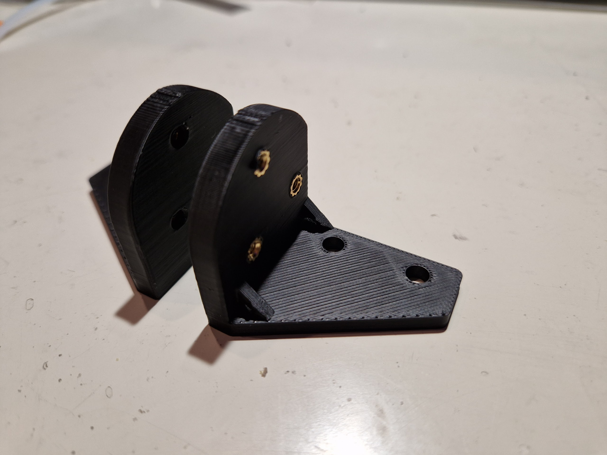
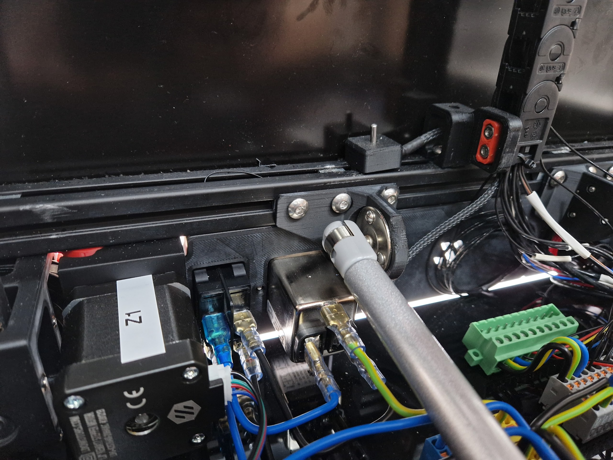
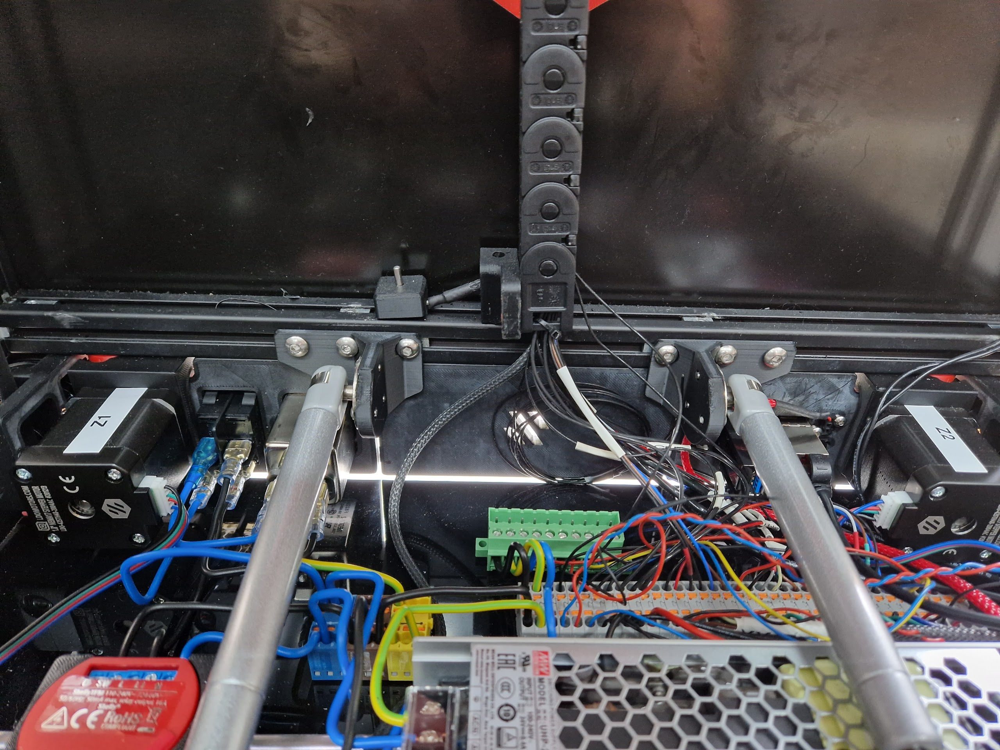
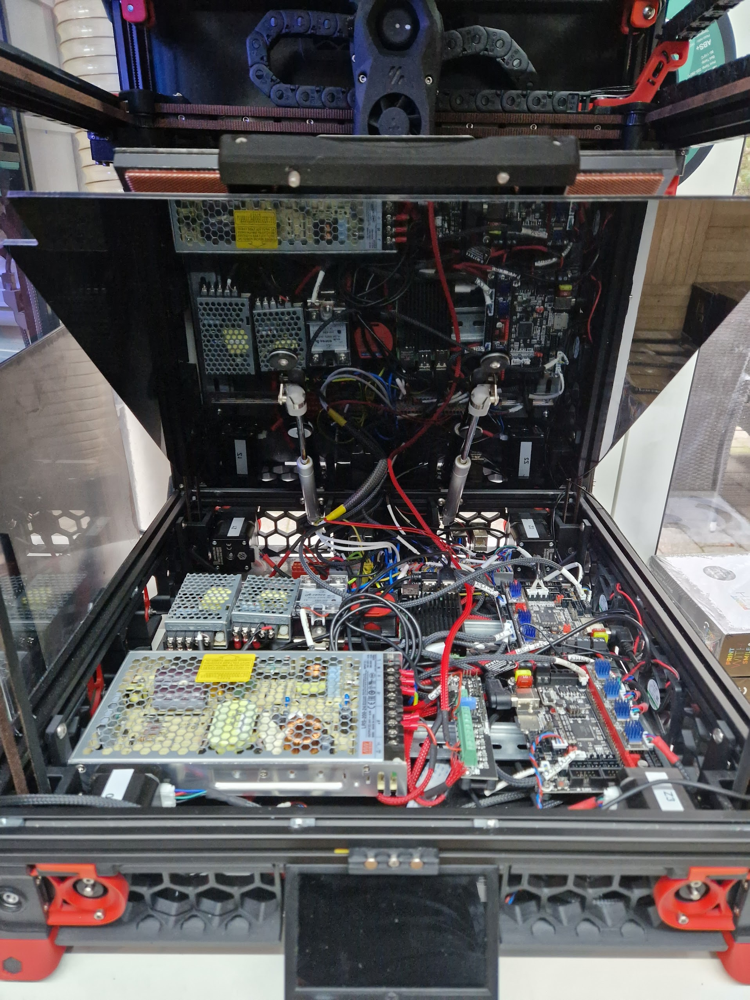

**Voron 2.4 Bed Hinge Mod**

Voron Bed Hinge Mod, as i'm too lazy flip my printer everytime i wan't to access the electronics.
Don't know what inverted electronics mod was i used in my 2.4, but as i used the mod of [LoganFraser](https://github.com/VoronDesign/VoronUsers/tree/master/printer_mods/LoganFraser/TridentInvertedElectronics) in my trident, i highly recommend that.
I tested this bed hinge mod only on a 300 spec Voron, if and how it fits other sizes, i can't tell.

**BOM**
|Part NO.  |Qty  |Ali|
|--|--|--|
| Gas Spring 100n | 2 | [Link](https://s.click.aliexpress.com/e/_DluMizP)|
| Brass Heatset Inserts - M3x5x4 | 6 | [Link](https://s.click.aliexpress.com/e/_DEYZcUl)|
| M5x16 BHCS ISO 7380-1 | 2 | [Link](https://s.click.aliexpress.com/e/_DBHI0Xx)|
| M5x10 BHCS ISO 7380-1 | 6 | [Link](https://s.click.aliexpress.com/e/_DnS0m6D)|
| M3x6 BHCS ISO 7380-1 | 4 | [Link](https://s.click.aliexpress.com/e/_Ddd8Uah)|
| M3x8 BHCS ISO 7380-1 | 6 | [Link](https://s.click.aliexpress.com/e/_Ddd8Uah)|
| M3x16 BHCS ISO 7380-1 | 4 | [Link](https://s.click.aliexpress.com/e/_DnN3TNT)|
| M3 Roll-in Nut | 8 | [Link](https://s.click.aliexpress.com/e/_DDP9fut)|
| M5 Roll-in Nut | 8 | [Link](https://s.click.aliexpress.com/e/_DkqEN7P)|
| 20x20 profile hinges | 2 | [Link](IMAGES/joint_connector.png)|

for all bed connections i used some ponenix contact MSTBT 2,5/15-ST-5,08 connectors
[order number 1781111](https://www.buerklin.com/de/p/phoenix-contact/steckverbindersysteme/1781111/63P6292/) and [order number 1788664](https://www.buerklin.com/de/p/phoenix-contact/steckverbindersysteme/1788664/63P7120/)

**Pre-Assembly**
- order all the hardware
    - for the joint connector i recommend a connector that can be clamped, so it can't wobble
- print all the parts with voron standard settings
    - they are all oriented in the proper way
    - you don't need any supports, but proper cooling
    - use voron standard settings
    - use abs, ore more heat resistant material
        - others WILL melt and bent
- Order the custom [Deck Panel](DXF/deck_panel_300_lifted.dxf) at e.g. [Kuststoffplattenonline](https://kunststoffplattenonline.de/product/alupanel-alu-verbundplatten-schwarz-3-mm/) (they offer the service for some more european countries, just look at their footer)
    - i choosed that service, as i can upload the dxf for production

**Assembly**
- insert the heat inserts into the gasspring holders
- 
- bolt on the round metal gasspring holder with the M3x8 BHCS screws
- 
- bolt them to the rear of the frame with the M5x10 BHCS
- 
- disassemble your bottom deck plate
- bolt on the printbed stabilitzer, more to the rear, mind the space for e.g. a nevermore
- bolt on the printbed handle
- bolt on the joint connectors
- flip the howl deck assembly and assemble the gasspring holders (the hinge balls should look totwards the outside of the bed) °-| |-°
    - don't fully tighten the screws for the deck gasspring holders
- add the deck spacers
- bolt on the new bottom deck plate with the deck screw plates and the M3x16 BHCS screws
    - don't tighten them too much, as the screw plates will flex
- bolt the bed assembly with the joint connectors into the printer
- use some zip ties, cord, wire, whatever you have to keep the bed in an upright position
- insert the gasprings into their holders
    - you might have to open the retainers a bit with a screwdriver
- 
- align the gassprings, so they will push straight
- now use a ballhead screwdriver to fully tighten the screws of the deck gasspring holders
- remove the bed retainer (zipties, cord, whatever) and slowly close the bed
- insert some M5x16 BHCS into the bed handle
- you are done

## Notes
- You can contact me via Discord "Gi7mo!#4618"
- This readme file contains Amazon Associate, Aliexpress affiliate, PCBWay affiliate links. I make a comission on qualifying purchases.
- This project does not come with any warranty, if you choose to build/use one, you are doing this at your own risk!
- special thanks to [xbst](https://github.com/xbst/VoronUsers/tree/master/printer_mods/xbst_/Bed_Hinge) whose mod inspired me for mine
- special thanks to homewerken, who originally designed the bed handle and brace
